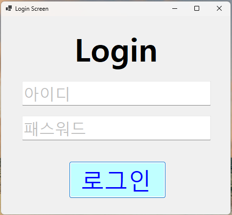

# (C# 코딩) 로그인 스크린

## 개요
 -C# 프로그래밍 학습
 -1줄 소개: 아이디와 패스워드를 입력받아 로그인하는 프로그램.
 -사용한 플랫폼: 
  -C#, .NET Windows Forms, Visual Studio, GitHub
 -사용한 컨트롤:
  -Label, TextBox, Button
 
 -사용한 기술과 구현한 기능:
  -Visual Studio를 이용하여 UI 디자인.
  -논리 연산자를 사용하여 로그인 성공 여부 확인.
  -Placeholder 기능 구현.
  -if ~ else 문을 활용하여 상황별 분기 처리.
  -MessageBox를 사용하여 사용자에게 피드백 제공.
  -로그인 결과에 따라 필요한 정보 제공.

## 실행 화면
 -과제1 코드와 실행 스크린샷

 

 -과제 내용
  -Label(제목), TextBox(아이디와 패스워드 입력), Button(로그인)을 배치합니다.
  -txtID와 txtPW에 Enter, Leave 이벤트를 연결하여 Placeholder 기능을 구현합니다.
  -패스워드 입력창은 보안을 위하여 UseSystemPasswordChar 속성이 적용되도록 합니다.

 -구현 내용과 기능 설명
  -btnLogin 입력 시 정해진 아이디와 패스워드를 비교하여 로그인 가능 여부를 판단한다.
  -아이디와 패스워드 전부 일치할 경우 "로그인 성공" 메시지를, 하나라도 다를 경우 "로그인 실패" 메시지를 출력한다.
  -아무것도 입력되지 않았을 경우 각각 "아이디", "패스워드" 메시지를 회색으로 출력하여 입력 여부를 표시한다.
